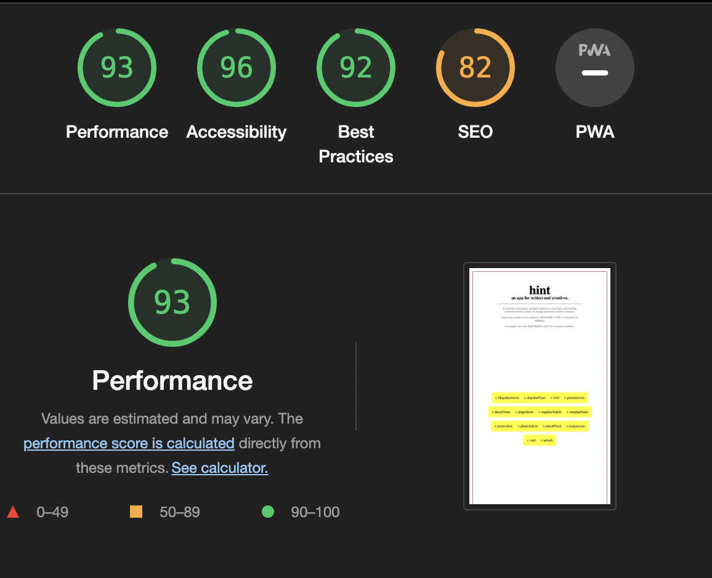

# hint

Hint is an application designed for writers and creatives. It empowers users to generate surrealistic fictional sentences, serving as a catalyst to jumpstart their writing, overcome writer's block, or engage in playful creative exercises.

Users have the flexibility to either generate a sentence composed of random words, resulting in an open-ended and playful narrative, or they can input specific words, combining their choices with randomly selected words to unlock new meanings and creative possibilities.

## Features

### Layout

The app boasts a clean and spacious layout, exuding a sense of tranquility and clarity conducive to creativity. With a simple red margin framing the page, it emulates the appearance of a flashcard or a card from classical board games.

### Header

The header complements the app's minimalistic design. A simple logo graces the top of the page, adding a touch of identity to the page while maintaining a clean and uncluttered appearance.The main title logo is intentionally presented in lowercase, symbolizing the concept of hints that both precede and follow unfinished writing, fostering an atmosphere of openness. The logo is followed by a subtitle summarizing the app's function and by short and clear instructions on how to use it.

### Instructions vs Sentence

The app operates in two distinct moments: The first presents a set of straightforward usage instructions in conjunction with the sentence's semantic structure, enabling users to type desired words. In the second moment, words that weren't defined by the user are substituted with random words of the specified type, crafting a coherent and readable although poétic and open ended sentence. In this latter mode, the instructions vanish, providing a minimalistic interface that encourages focus and creativity in writing.

### Footer

A discreet footer contains copyright information.

### Features left to implement

In the future, there are plans to develop a system enabling the app to verify and incorporate user-input words into the respective word arrays. Users would have individual logins where their grammar additions would be stored, creating a personal grammar field that the app would incorporate, adding a personalized touch to the randomness.

## Testing

I tested that the website works in different browsers: Chrome, Firefox, Safari.

I used devtools and [Am I Responsive tester](https://ui.dev/amiresponsive) to confirm that the website is responsive, looks, and functions as it is supposed to on all standard screen sizes.

Extensive testing was conducted on the button and typing functionalities, with any identified bugs addressed to ensure the app's smooth operation.

## Bugs

Initial formatting bugs were encountered, leading to the appearance of spaces between different div elements forming the yellow sentence. These formatting issues were rectified through a slightly negative margin.

An independent div was introduced to style the red margin and resolve formatting challenges.

Issues were also present in the button's dual functionality, where it both generated random words from arrays and checked div elements for user-defined inputs while reformatting the layout to transition between the two app scenarios. This presented a unique challenge, as the aim was to keep the app extremely minimal to provide a spacious environment for creative writers. Multiple iterations were required to ensure that everything worked seamlessly with just one button.

### Unsolved bugs

No unsolved bugs.

## Validator Testing

### HTML

No errors or warnings were found when passing through the official W3C validator.

### CSS

No errors or warnings were found when passing through the official W3C (Jigsaw) validator.

### Accessibility and Performance

Using Lighthouse in devtools, I confirmed that the website is performing well, accessible, and the colors and fonts chosen are readable.

## Deployment

The website was deployed to GitHub pages and can be accessed by the link: [hint](https://dinismachado87.github.io/hint/)

## Credits

Input on Flexbox from the YouTube channel of [Kevin Powell](https://www.youtube.com/user/KepowOb)
