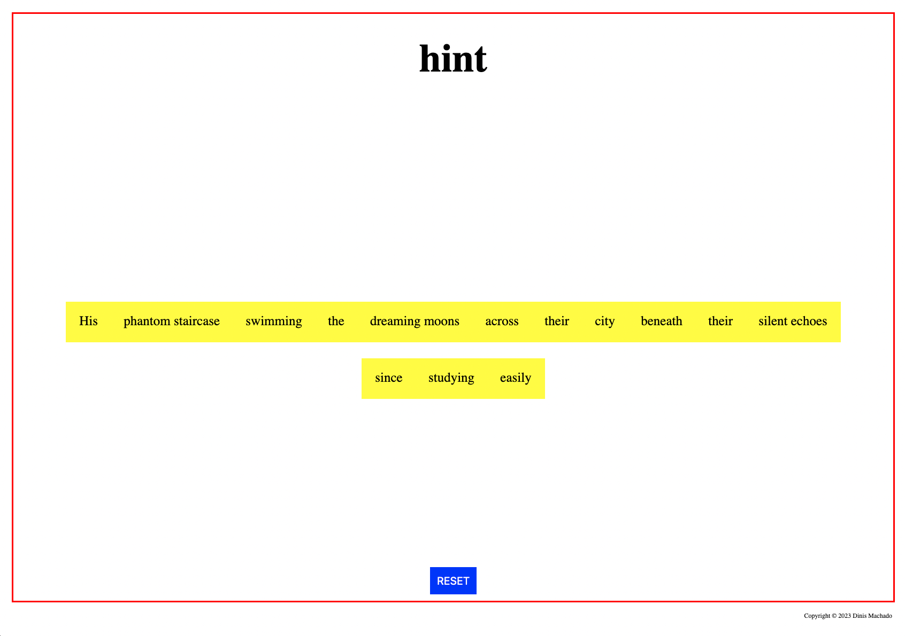

# hint

Hint is an app designed for writers and creatives. It allows users to generate surrealistic fictional sentences to kickstart their writing, overcome writer's block, or engage in playful creative exercises.

Users can either generate a sentence composed of random words that form a readable but fictional, open ended and playfull sentence, or they can type in some of the words they need new perspectives on to create a sentence that combines their input with other randomly selected words opening new meanings and possibilities.

## Features

### Layout

With a simple and open layout we search that the app layout has a feealing of open space creating a calm and claer feeling for confort and creativeness. With a simple red margin around the browser the page resembles a flashcard or a card from classical boardgames.

### Logo

Featured at the top of all pages, there is a simple logo creating identity to the page but quite simple for a feeling of uncluterness.

### Instructions vs Sentence

The app works with only two situations: a first moment where a set of simple instructions of use is displayed together with the semantic structure of the sentence allowing the user to define certain desired words. And a second moment where the words that were not typed/defined by the user are replaced by random words of the specific kind needed to produce a readable sentence. In this second moment of the app the instructions disapear letting the user with a quite stripped out screen to produce the focus necessary for creative writing.

## Testing

I tested that the website works in different browsers: Chrome, Firefox, Safari.

I used devtools and [Am I Responsive tester](https://ui.dev/amiresponsive) to confirm that the website is responsive, looks, and functions as it is supposed to on all standard screen sizes.

I tested thoroughly the button and typing functinalities and fixed all bugs until the app worked smoothly.

## Bugs

I encountered formating bugs where spaces would appear betweens the different div's that form the yellow sentece and corrected them.

I had also to create a independent div to style the red margin to resolve formating issues.

There were bugs in the crossover of the button click both generating random words from the arrays, checking div's had been typed to skip them and reformulating the lay out between the two sceneries of the app. I wanted the app to be extremely minimal to feel spacious for a writers creativity and it took some trial and error to make everything work with only one button.

### Unsolved bugs

No unsolved bugs.

## Validator Testing

### HTML

No errors or warnings were found when passing through the official W3C validator.

### CSS

No errors or warnings were found when passing through the official W3C (Jigsaw) validator.

### Accessibility and Performance

Using Lighthouse in devtools, I confirmed that the website is performing well, accessible, and the colors and fonts chosen are readable.

## Deployment

The website was deployed to GitHub pages and can be accessed by the link: [Build a Shed!](https://dinismachado87.github.io/buildashed-main/index.html)

## Credits

Gallery images taken from [Unsplash](https://unsplash.com/)

3D cottage simulation and instruction images drawn by me in [SketchUp](https://www.sketchup.com/)

Input on Flexbox from the YouTube channel of [Kevin Powell](https://www.youtube.com/user/KepowOb)
